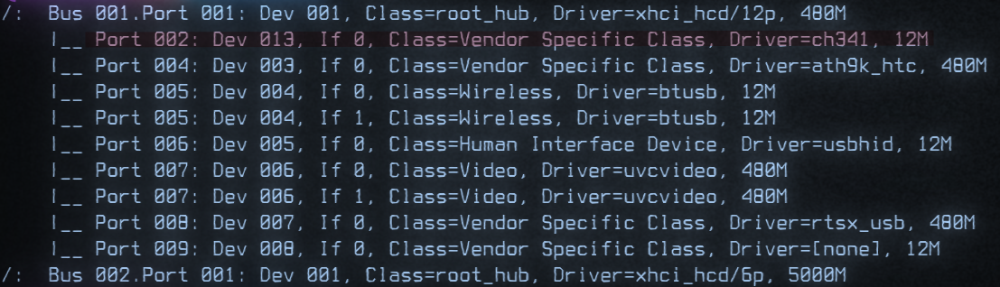

# Embedded systems and you

I am strung between many things at this point in my life. Listed as Armed and Dangerous, Fugitive wizard at large. Spending some time in the dungeons and finally getting to have my time before the tribunal was a great time to focus my wildly attention. I feel stronger and sharper as of late. Like I have a direction to follow once again. That direction has been pushing to delve once again into the topics I do not understand. 

The dreaded art of Embedded Systems. 

Lets thrown on some Time Fragment - 装甲艦 and learn some strangeness.

Getting I had to order from the mages guild some ESP8266's, ESP32's, and some digikey sparks. With my small boards I had to learn about some rather simple but obscure knowledge.

### Inscriptions for an inscriber

A small bit of magic works between the main chip on the board and your computer. This might be a CH340 or *INSERT OTHER HERE*

What these little dude do for you is convert between USB (Your Computer) and Serial (The ESP32, ESP8266 or whatever). This is our friend but we must know which friend we need to learn to speak with. I found out by asking my system. 

Using `sudo lsusb -t` you can get the above. I know I have ch341 that is handling that communication. I can also double check that I am able to see this device by looking in DEV.

Using `ls /dev` and I can see the ttyUSB0 device which would be present due to the UART to USB CH341 chip. 

### Arduino the savior for beginning

Moving into the space of we understand our chip and our interface tool. We can now begin to attempt and pass instructions to this chip which should relay that to the ESP8266 in my situation. 

`yay arduino` was all it took for me to install Arduino, if you are not using pacman or yay please find your own solution to this issue. After spending some time working with ESP8266's and making some little wifi point that can be used for new students to practice wifi hacking. It really is a great platform for development. It can take some setting up but once you do it a couple of times it does make for a nice setup.

---

## Embedded Shinanigans

Figuring out some nice project I watched the michael reeves video on making a little turret. It was funny but it was also a increadbly simple project to do with a lot of fun to motivate you to complete it. Which in if you have not taking note of yet. Fun is often the determination of completion or not. You can chase a project but once you learn what you need you tend to drop a project unless it has some fun to it in which you often will push to completion.

So we have an X and a Y we must focus on. 
[-] X is how we will turn Left and Right.
[-] Y is how we will move up and down.

With these two and a small laser we can show our ability to send and process data.. I am using Rust as my main way of processing computer data and then all the arduino has to do is intake information and adjust the motors/servos to reflect the values..

I know from michaels video he had an issue with the arudino being unable to process the amount of information being sent. So I want to lower the amount of processing we send to the arduino..

So some kind of checking system to manage sending updates.. So I am thinking something like "Hey I have information" -> "Okay well if its not greater than x% of change then we will not send it" -> "If it is then we will send it" I am thinking while this might reduce accuracy it will lower the load on the arduino...
